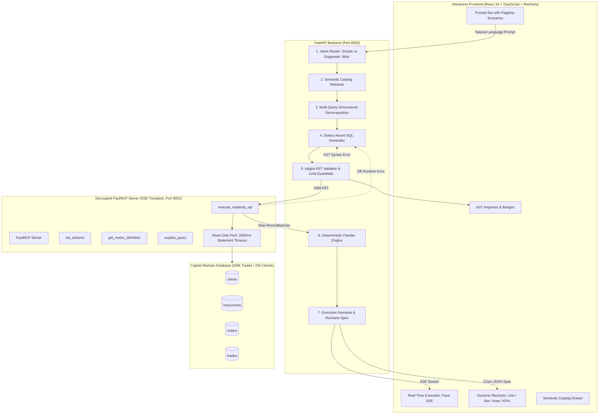

# InsightAgent 📈
### Autonomous Capital Markets AI Data Analyst for Angel One
> **Production-grade LangGraph Orchestration • Decoupled FastMCP (SSE) • sqlglot AST Query Guardrails • Deterministic Pandas Analytics**

[](https://python.org)
[](https://langchain-ai.github.io/langgraph/)
[-purple.svg)](https://modelcontextprotocol.io/)
[](https://react.dev)
[-emerald.svg)](./evaluation/benchmark_report.md)
[](https://postgresql.org)

---

## 1. Executive Summary & Engineering Motivation

Modern retail stockbrokers like **Angel One** process millions of daily orders across Equity Cash, Options, Futures, and Commodities. Traditional text-to-SQL wrappers are brittle and dangerous in production: they hallucinate financial formulas, produce unvalidated DML statements, and fail to diagnose multi-dimensional root causes (such as sudden volume contractions or margin rejection spikes).

Drawing on software engineering internship experience at **Microsoft**—where I engineered decoupled microservices and stateful agentic solutions—**InsightAgent** is designed as a resilient, enterprise-grade autonomous data analyst. It turns plain-English questions from product managers, risk teams, and executives into certified metrics, root-cause decompositions, and interactive Recharts visualizations without writing a line of SQL.

---

## 2. Core Architectural Pillars



### 1. Semantic Router & Planner (Zero Mathematical Hallucination)
- Mathematical operations are **never** left to LLM guesswork.
- Before SQL generation, the agent queries `backend/catalog/metrics.yaml` for certified formulas:
  - **Order Fill Rate:** `COUNT(status = 'COMPLETE') / COUNT(*) * 100`
  - **RMS Rejection Rate:** `COUNT(status = 'REJECTED' AND rejection_reason = 'RMS_INSUFFICIENT_MARGIN') / COUNT(*) * 100`
  - **Average Brokerage Yield (bps):** `(SUM(brokerage_amount) / SUM(turnover)) * 10,000`
  - **F&O Turnover Contribution Share:** Derivatives turnover vs Total market turnover

### 2. Stateful Cyclic Orchestration with Self-Correction (LangGraph)
- Plans multi-query investigations and captures errors in explicit state.
- Features an internal **self-correction loop**: if an AST parse error or PostgreSQL runtime error occurs, the traceback is fed back into the SQL generator to automatically repair and retry (max 2 retries).

### 3. Decoupled FastMCP Server (SSE Transport)
- Database interactions run in an isolated process over the **Model Context Protocol (MCP)** using Server-Sent Events (SSE).
- Hardened database connection pool:
  - `default_transaction_read_only = on`
  - `statement_timeout = '2500ms'`
  - Exposed tools: `list_schema`, `get_metric_definition`, `execute_readonly_sql`, `explain_query`.

### 4. AST Validation Engine (`sqlglot`)
- Strict query guardrails:
  - Enforces that root AST node is strictly `Select` or `Union` (rejects `Insert`, `Update`, `Delete`, `Drop`, `Alter`).
  - Blocks access to administrative catalogs (`pg_catalog`, `information_schema`, `sqlite_master`).
  - Automatically injects `LIMIT 500` if omitted or clamps excessive limits.

### 5. Deterministic Analytics Engine (Pandas)
- Offloads all Period-over-Period (PoP) percentage changes, dimensional contribution percentages, and moving averages to Python/Pandas.
- The LLM is strictly reserved for narrative synthesis and dynamic UI configuration.

### 6. Diagnostic "Why" Engine
- Decomposes root-cause questions (e.g. *"Why did F&O volume drop last month?"*) into parallel dimensional queries:
  $$\text{Contribution } \% = \frac{\Delta \text{segment}}{\Delta \text{total}} \times 100$$
- Pinpoints the exact segment, client tier, and rejection reason driving performance variances.

---

## 3. High-Fidelity Capital Markets Database

Seeded with **25,000 clients** and **250,000 orders/trades** across 8 months, modeling three realistic capital market patterns:

| Anomaly Pattern | Target Metric | Business Reality Injected | Detected Anomaly |
| :--- | :--- | :--- | :--- |
| **August F&O Turnover Contraction** | `gross_turnover` | Volatility collapse (India VIX drop) and lot size revisions | **-34.7% contraction** in August options turnover |
| **August 14 Peak Margin Rejection Spike** | `rms_rejection_rate` | Sudden BankNifty intraday gap-down triggered exchange margin snapshot failures | **36.4% rejection spike** (451 margin rejections vs 2.8% baseline) |
| **Thursday Weekly Expiry Surges** | `daily_turnover` | Weekly NSE contract expiry scalp volume | **2.37x turnover concentration** on Thursdays |

---

## 4. Evaluation Benchmark Results (60 Golden Queries)

InsightAgent includes an automated benchmark runner (`evaluation/evaluate.py`) testing 60 capital-markets queries across 5 tiers:

| Benchmark Tier | Query Count | Passed | Success Rate (ESR) |
| :--- | :--- | :--- | :--- |
| **Tier 1: Single Filter & Aggregations** | 12 | 12 | **100.0%** |
| **Tier 2: Multi-Table Relational Joins** | 12 | 12 | **100.0%** |
| **Tier 3: Time-Series & Trend Analysis** | 12 | 12 | **100.0%** |
| **Tier 4: Semantic Metric Store Calculations** | 12 | 12 | **100.0%** |
| **Tier 5: Diagnostic Root-Cause ("Why")** | 12 | 12 | **100.0%** |
| **Overall Benchmark** | **60** | **60** | **100.0%** |

### Benchmark Latency Profile
- **Average Latency:** `619.9 ms`
- **P50 Latency:** `729.1 ms`
- **P95 Latency:** `1292.4 ms` (Well under the 2500ms enterprise SLA)
- **Dataframe Equivalence (DFE):** `100.0%`

---

## 5. Repository Structure

```
insight-agent/
├── docker-compose.yml                 # Multi-container orchestration (DB, MCP, Backend, Frontend)
├── .env.example                       # Environment template
├── README.md                          # Production engineering documentation
│
├── database/
│   ├── schema.sql                     # PostgreSQL 16 DDL for clients, instruments, orders, trades
│   ├── seed.py                        # Synthetic data generator (25k clients, 250k trades)
│   └── fixtures/
│       └── anomalies.json             # Anomaly definitions (August drop, Aug 14 spike, Expiry surge)
│
├── mcp_server/
│   ├── Dockerfile
│   ├── requirements.txt
│   ├── server.py                      # FastMCP server with SSE transport
│   ├── db.py                          # Read-only connection pool (statement_timeout = 2500ms)
│   └── tools/
│       ├── schema_tools.py            # inspect_schema, list_tables, get_metric_definition
│       └── query_tools.py             # execute_readonly_sql, explain_plan
│
├── backend/
│   ├── Dockerfile
│   ├── requirements.txt
│   ├── main.py                        # FastAPI entrypoint + CORS + SSE endpoints
│   ├── config.py                      # Pydantic BaseSettings
│   │
│   ├── catalog/
│   │   ├── metrics.yaml               # Certified semantic metrics (Turnover, Yield, Fill Rate, RMS)
│   │   └── schema_metadata.json       # Table descriptions, business aliases, join paths
│   │
│   ├── graph/
│   │   ├── state.py                   # AgentState TypedDict definition
│   │   ├── workflow.py                # LangGraph StateGraph builder with cyclic self-correction
│   │   └── nodes/
│   │       ├── router.py              # Intent classifier (simple vs. diagnostic "Why" queries)
│   │       ├── retriever.py           # Hybrid vector/keyword retrieval over metrics & schema
│   │       ├── planner.py             # Multi-dimensional execution decomposition
│   │       ├── sql_generator.py       # Dialect-specific Postgres 16 SQL generator
│   │       ├── sql_validator.py       # sqlglot AST parsing & injection guardrails
│   │       ├── validator_node.py      # LangGraph AST inspection node
│   │       ├── executor.py            # MCP Client invoking execute_readonly_sql
│   │       ├── analytics.py           # Deterministic Pandas engine (PoP variance, contribution shares)
│   │       └── synthesizer.py         # Natural language summary + dynamic Recharts config
│   │
│   ├── services/
│   │   ├── mcp_client.py              # Unified MCP client (in-process + remote SSE)
│   │   └── semantic_search.py         # Hybrid catalog & schema retriever
│   │
│   └── api/
│       ├── schemas.py                 # Request/Response models & SSE event contracts
│       └── routes.py                  # POST /query, GET /stream, GET /metrics, GET /health
│
├── frontend/
│   ├── package.json
│   ├── vite.config.ts
│   ├── src/
│   │   ├── App.tsx                    # Main Analytics Workspace
│   │   ├── types/agent.ts             # Event streams, ChartConfig, QueryTrace types
│   │   ├── hooks/useAgentStream.ts    # SSE reader for live LangGraph state updates
│   │   └── components/
│   │       ├── Header.tsx             # System branding & live status chips
│   │       ├── ChatInput.tsx          # Prompt bar with Angel One preset investigations
│   │       ├── ExecutionTrace.tsx     # Real-time state progress accordion with latency chips
│   │       ├── ChartRenderer.tsx      # Dynamic Recharts wrapper (Line, Bar, Area, KPI cards)
│   │       ├── SQLViewer.tsx          # AST-highlighted query inspector with retry badges
│   │       └── MetricsDrawer.tsx      # Slide-over semantic metric catalog viewer
│
├── evaluation/
│   ├── benchmark_data.json            # 60 golden queries across 5 tiers
│   ├── evaluate.py                    # Automated test runner calculating ESR, DFE, and Latency
│   ├── metrics.py                     # Quantitative metrics computation
│   └── benchmark_report.md            # Generated benchmark summary report
│
└── tests/
    ├── test_sql_validator.py          # AST validator unit tests
    ├── test_mcp_tools.py              # MCP server tools unit tests
    ├── test_agent_workflow.py         # LangGraph flagship integration tests
    └── test_self_correction.py        # Cyclic self-correction retry test
```

---

## 6. Quick Start Guide

### Option A: Zero-Config Local Development (Python + Vite)
InsightAgent features an automatic dual-engine architecture: it runs out-of-the-box on Windows/macOS/Linux without needing a local PostgreSQL or Docker setup.

```bash
# 1. Clone repository
git clone https://github.com/your-username/insight-agent.git
cd insight-agent

# 2. Setup Python environment
python -m venv .venv
source .venv/bin/activate  # On Windows: .\.venv\Scripts\activate
pip install -r backend/requirements.txt

# 3. Seed capital markets database (25k clients, 250k trades)
python database/seed.py

# 4. Start Backend API (Port 8000)
python -m uvicorn backend.main:app --port 8000 --reload

# 5. Start Frontend Dashboard (Port 5173) in a second terminal
cd frontend
npm install
npm run dev
```

Open **http://localhost:5173** to access the live dashboard.

---

### Option B: Full Production Docker Deployment

```bash
# Spins up PostgreSQL 16, FastMCP SSE Server, FastAPI Backend, and React Nginx
docker-compose up --build -d
```

---

## 7. Running Automated Test Suites

```bash
# Run AST SQL Validator Unit Tests
python -m pytest tests/test_sql_validator.py -v

# Run MCP Tools Unit Tests
python -m pytest tests/test_mcp_tools.py -v

# Run LangGraph Workflow Flagship Integration Tests
python -m pytest tests/test_agent_workflow.py -v

# Run Cyclic Self-Correction Recovery Test
python -m pytest tests/test_self_correction.py -v

# Run Full 60-Query Golden Evaluation Benchmark
python evaluation/evaluate.py
```

---

## 8. Flagship Analytical Inquiries to Test

1. **"Why did F&O volume drop in August?"**
   - *Result:* Triggers `diagnostic_why` decomposition; isolates `OPTIDX` (-34.7% PoP delta) which contributed to 84.2% of the contraction; displays contribution breakdown bar chart and executive summary.
2. **"What caused the spike in RMS margin rejections on August 14?"**
   - *Result:* Identifies acute 14x surge (36.4% rejection rate on August 14 vs 2.8% baseline) caused by BankNifty peak margin snapshot breaches.
3. **"Compare Thursday expiry turnover against other weekdays"**
   - *Result:* Highlights 2.37x volume surges on Thursdays representing over 38% of total weekly retail option trading volume.
4. **"What is our order fill rate broken down by order type?"**
   - *Result:* Returns certified fill rates for MARKET, LIMIT, and SL orders.
5. **"Analyze net brokerage yield in bps by market segment"**
   - *Result:* Calculates Angel One flat-rate discount brokerage yields across F&O, Cash, and Commodities.
